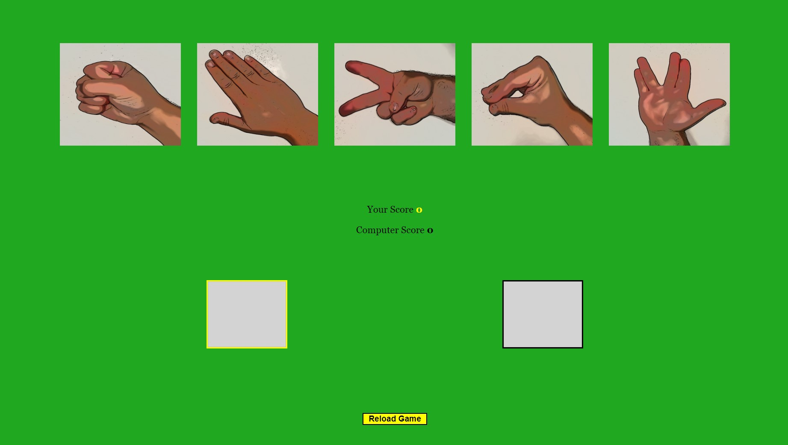
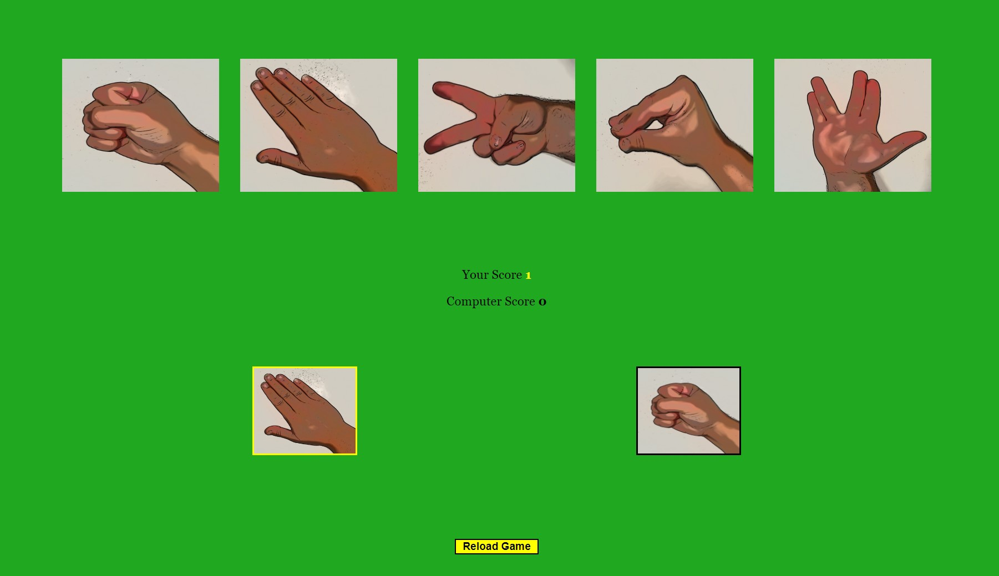
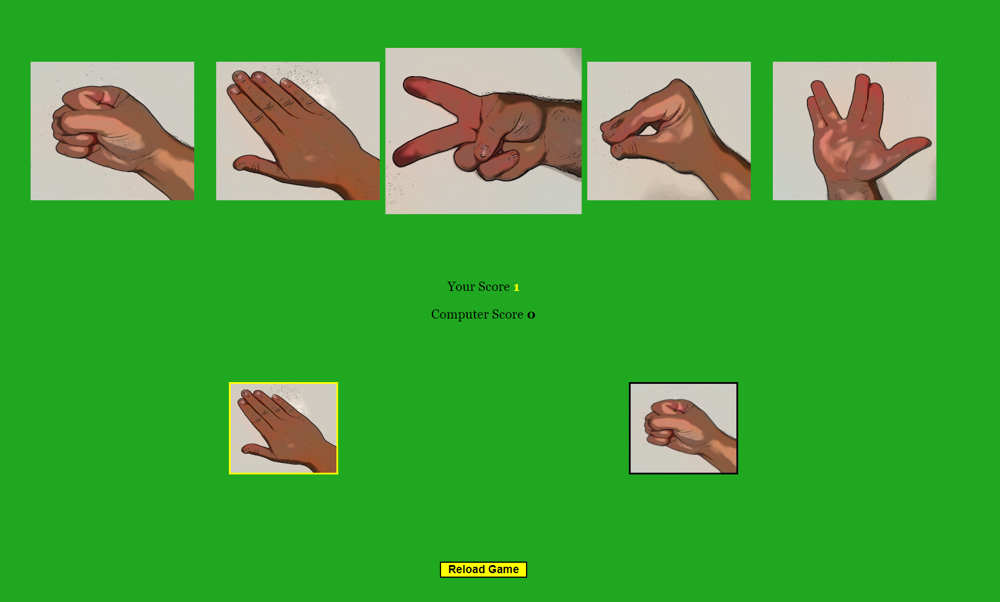

# Welcome to The Sheldon Cooper Game!

This is a game of rock paper scissors, with a small extension to rock paper scissors lizard spock.
It's a game that comes from the beloved Tv Show "Big Bang Theory"

The game however is pretty simple with only a few tweeks.
For fans and other people who enjoyed the Tv Show, this game and it's game-masters description is hopefully something that provokes humor for the user.
It's a simple one page game with features that are easy to understand and follow to play the game.

I had alot of fun channelling my inner Sheldon, so I hope that it comes across as humoristic and nothing else.

Enjoy!

------------------------------------------------------------------------------------------------------------------------------------------------------------------------------

## The Users Goals

* The user wishes to play a Rock, Paper, Scissors, Lizard, Spock game against the computer, using a score count.

## A New User
* Can easely find the game and play it as many times as he or she wants.

------------------------------------------------------------------------------------------------------------------------------------------------------------------------------
# Strategy
------------------------------------------------------------------------------------------------------------------------------------------------------------------------------
## Header

* The header is to indicate humor, that the person who created this game is in fact our beloved tv character "Dr Sheldon Cooper" from the series "Big Bang Theory"

----------------------------------------------------------------------------------------------------------------------------------------------------------------------------
## Navigation

* There is no navigation bar at this point, but there might be in upcoming updates.
------------------------------------------------------------------------------------------------------------------------------------------------------------------------------

## The top div with the words 
"Greetings adventurer" followed by some text, is humoristic take on the task of making a Rock paper scissors lizard spock game.
It is meant to both inform the user of the rules of the game, but also to bring forth a chuckle or a smile as they read through what was my imitation of "Sheldon Cooper".

--------------------------------------------------------------------------------------------------------------------------------------------------------------------------

## Game area

The game is presented with 5 options at the top, 5 images of a hand doing the sign for either rock, paper, scissors, lizard or spock.
The images are clickable and enlarge upon being hovered over.

Further down there are two empty boxes, one to the left and one to the right.
The one to the left has a yellow border, and the one to the right has a black border.
Underneath these two empty boxes you have the score area where the words Your Score followed by a yellow number, and underneath another line of Computers Score and a black number. These are the indicators of which box belongs to whom.
The yellow box and the yellow number, represents the users choice, and vice versa for the computer but while using black as its indicator.

Below the score area there is a yellow button with the text "Reload game" which while hovered over has a pointer marker, and when pressed, refreshes the whole page and the game itself.

Above the button there is also a invisible div with the game over message that presents itself after either the user or the computer exceeds a score > 3.
With the text 'Game Over! - Oh would you look at that? You actually won. Kudos.' if the user wins, or 'Game Over! - Unsurprisingly, you have lost.' if the computer wins.

Below this there is a footer with Sheldon coopers full signature and copyright icon. "Dr Sheldon Lee Cooper B.S, M.S, M.A, Ph.D, Sc.D ©2022"

----------------------------------------------------------------------------------------------------------------------------------------------------------------------------
## Footer
* Shows the name and full list of diplomas for Sheldon cooper, as well as a copyright mark.

-------------------------------------------------------------------------------------------------------------------------------------------------------------------------------

## Possible upcoming features

* A way for the user to put in his or her username.
* A highscore billboard
* A "Play Game" button that takes the user to a separate page where the game is, instead of it being on the first page with the introduction.
* A feature that makes the winning choice grow larger and the loosing choice get the opacity of 0.5, followed by a reset of the two before next choices are presented.

------------------------------------------------------------------------------------------------------------------------------------------------------------------------
# Design

## Colours

* The colours are strong and eyecatching while staying simple, as to not confuse the user or drag away the attention from the game.
---------------------------------------------------------------------------------------------------------------------------------------------------------------------------------
## Fonts

* I am using Georgia, Times New Roman, Times, serif, I think this give the site the look of a newspaper article, or somewhat a little old fashioned, which I believe is what "Sheldon Cooper" were to use if he excisted.

----------------------------------------------------------------------------------------------------------------------------------------------------------------------------
## Screen Shots 
 
 
 
 
 

-----------------------------------------------------------------------------------------------------------------------------------------------------------------------------

# Testing

## As a new user

* If the user clicks "Rock" the computer will generate a random choice between Rock, Scissors, Paper, Lizard, Spock.

* If the computer chooses 'Rock' it is a tie and no one scores.
* If the computer chooses 'Paper' the computer scores 1 point.
* If the computer chooses 'Scissors' the user scores 1 point.
* If the computer chooses 'Lizard' the user scores 1 point.
* If the computer chooses 'Spock' the computer scores 1 point.

* If the user clicks "Paper" the computer will generate a random choice between Rock, Scissors, Paper, Lizard, Spock.

* If the computer chooses 'Rock' the user scores 1 point.
* If the computer chooses 'Paper' it is a tie and no one scores.
* If the computer chooses 'Scissors' the computer scores 1 point.
* If the computer chooses 'Lizard' the computer scores 1 point.
* If the computer chooses 'Spock' the user scores 1 point.

* If the user clicks "Scissors" the computer will generate a random choice between Rock, Scissors, Paper, Lizard, Spock.

* If the computer chooses 'Rock' the computer scores 1 point.
* If the computer chooses 'Paper' the user scores 1 point.
* If the computer chooses 'Scissors' it is a tie and no one scores.
* If the computer chooses 'Lizard' the user scores 1 point.
* If the computer chooses 'Spock' the computer scores 1 point.

* If the user clicks "Lizard" the computer will generate a random choice between Rock, Scissors, Paper, Lizard, Spock.

* If the computer chooses 'Rock' the computer scores 1 point.
* If the computer chooses 'Paper' the user scores 1 point.
* If the computer chooses 'Scissors' the computer scores 1 point.
* If the computer chooses 'Lizard' it is a tie and no one scores.
* If the computer chooses 'Spock' the user scores 1 point.

* If the user clicks "Spock" the computer will generate a random choice between Rock, Scissors, Paper, Lizard, Spock.

* If the computer chooses 'Rock' the user scores 1 point.
* If the computer chooses 'Paper' the computer scores 1 point.
* If the computer chooses 'Scissors' the user scores 1 point.
* If the computer chooses 'Lizard' the computer scores 1 point.
* If the computer chooses 'Spock' it is a tie and no one scores.

* Upon arrival the user sees a game presentation and then quickly grasps how to play the game.
* The user can re play the game as many times as she or he wants by simply pressing the reset game button. 

------------------------------------------------------------------------------------------------------------------------------------------------------------------------------

## As a returning user
* Same as for a new user, the game is simple, the site is easy to understand so that anyone can bring up the website and play if they want to.

----------------------------------------------------------------------------------------------------------------------------------------------------------------------------

# Validating HTML 5 and CSS 3

* Tested with The [W3C CSS Validation service](https://jigsaw.w3.org/css-validator/). Congratulations! No Error Found.
* Tested with The [W3C Markup Validation service](https://validator.w3.org/). No errors or warnings to show.
* Google Chrome developer tool to find any remaining errors.

----------------------------------------------------------------------------------------------------------------------------------------------------------------------------
# Bugs and fixes
* Had problem with the alert message that was static on the page, but I got help from Chris in tutor support to so that I could use an element there instead that I could style to pop up whenever computerScore > 3 or yourScore > 3, to set a number of turns before the game is over.
* Had problems with the message element moving around too much in my media quieries so finally I decided to remove the previous style from it and set it to be absolute with some margin and a br and it worked perfectly.

* Ran the The W3C CSS Validation service and The W3C Markup Validation service without errors.

* Ran the Jigsaw validator service without errors.

* Ran the Jshint Validation service without errors, apart for a remark about the img tag needing a src, but since this img tag was not used to actually hold an image, I disregarded this remark.

* Had a problem with the images being clickable after game over, so I added a function that removed the eventlistener for click when either the user or the computer reached a score of 4. 

* Was made awares of my wrong semantics, formatting and the lacking of comments to explain the various sections of code so I added these as well.

* Made an accurate testing section here in the readme file.

* Was made awares of the meaning of deployment so I added this to the readme file as well.

---------------------------------------------------------------------------------------------------------------------------------------------------------------------------------

# Deployment 

* I went to my GitHub page and went to my repositories, there I clicked The-Sheldon-Game.
* I then clicked settings and to the left lower side of the page, I clicked "pages".
* Under "branch" I selected main, and then clicked save.

* Site will be deployed to Github Pages
* This site is published at [https://ladyneowen.github.io/The-Sheldon-Game/](https://ladyneowen.github.io/The-Sheldon-Game/)

--------------------------------------------------------------------------------------------------------------------------------------------------------------------------------

# Credits

* I would like to thank Chris and Alex from tutor support for helping me in moments of dispair. 
* I would also like to thank my loving hubby Viktor Brandt, for helping me, soothing me and inspiring me to push on even when times are hard. 
  And also for taking most of the responsebility with our 2,5 year old son so mommy can study. 
  I love you Viktor.
* And of course a shoutout to my mentor Daisy McGirr for helping me and explaining to me with great patience when I was stuck, but also inspiring me with confidence where I lacked it. 

-------------------------------------------------------------------------------------------------------------------------------------------------------------------------------

# Media 
* Photos taken of my own hand and my boyfriends hand, using a cartoon filter.

---------------------------------------------------------------------------------------------------------------------------------------------------------------------------------------------
# Icons
* Fonts and icons are taken from [FontAwesome](https://fontawesome.com/v5/search)

----------------------------------------------------------------------------------------------------------------------------------------------------------------------------------------------
# Links to other used pages

* [Am I responsive](https://ui.dev/amiresponsive)
* [Rock paper scissors inspiration 1](https://www.youtube.com/watch?v=1yS-JV4fWqY)
* [Rock paper scissors inspiration 2](https://www.youtube.com/watch?v=fIBOydve2f8)
* [Rock paper scissors inspiration 3](https://www.youtube.com/watch?v=C2_z34QFVjw&ab_channel=DaveGray)
* [Markdown Cheatsheet](https://github.com/adam-p/markdown-here/wiki/Markdown-Cheatsheet)

## Thank you for popping in! Have a great day!
### // LadyNeowen